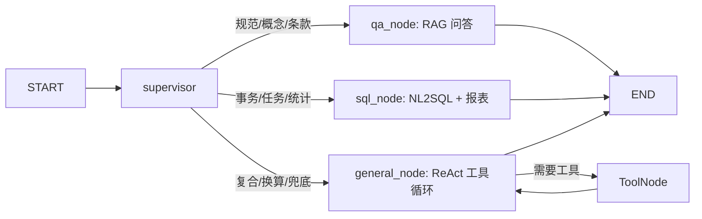

# PetroChat-Agent

> 石化领域智能问答与多 Agent 数据分析平台。项目基于真实石化规范文档和事务任务业务库，完整跑通 RAG、Tool Calling、MCP、Supervisor 多 Agent、NL2SQL 和报表输出，是面向 AI/LLM 应用研发岗位的 Python 工程实践项目。

[](#)
[](#)
[](#)
[](#)

## 项目亮点

- **垂直领域护城河**：基于 4 份石化规范文档构建 1500+ chunks 知识库，并接入事务/任务业务库，避免通用聊天项目的同质化。
- **阶段化工程演进**：从单节点 RAG 起步，逐步扩展到 Tool Calling、MCP Server、Supervisor 多 Agent，再到记忆管理与 Vue3 登录/RBAC 工作台。
- **多 Agent 路由闭环**：`supervisor` 根据意图路由到 `qa`、`sql`、`general` 三个子 agent，让规范问答、数据查询、复合工具任务职责清晰。
- **安全 NL2SQL**：使用 DeepSeek function calling 生成 SQL，`sqlglot` AST 校验只允许单条 SELECT，自动注入 LIMIT，并用 MySQL `MAX_EXECUTION_TIME` 控制慢查询。
- **可演示报表输出**：SQL 查询结果自动转 Markdown 表，适合的数据生成 base64 PNG 图表，通过 SSE `meta` 事件传给前端。
- **工程可观测与可测试**：LangSmith 链路追踪、FastAPI SSE 流式输出、Golden Set 回放/评估脚本和 95 个 pytest 测试覆盖核心逻辑。

## 技术栈

| 模块 | 选型 |
| --- | --- |
| 语言 | Python 3.12 |
| Agent 编排 | LangGraph StateGraph（Supervisor 模式） |
| LLM 应用框架 | LangChain |
| Web 框架 | FastAPI + SSE |
| 前端 | Vue3 + Vite + fetch SSE + Markdown 渲染 |
| 向量库 | Chroma HTTP 服务 |
| Chat / 推理 | DeepSeek `deepseek-chat`（OpenAI 兼容） |
| Embedding | 阿里云百炼 `text-embedding-v3`（1024 维） |
| 数据库 | MySQL 8 + SQLAlchemy + PyMySQL |
| NL2SQL 安全 | sqlglot AST 校验 + 只读账号 + MySQL 执行超时 |
| 报表 | pandas + matplotlib |
| MCP | 官方 `mcp` SDK + FastMCP + langchain-mcp-adapters |
| 依赖管理 | uv |
| 部署 | Docker + Docker Compose |

## 项目结构

```text
PetroChat-Agent/
├── pyproject.toml
├── docker-compose.yml
├── data/
│   ├── raw/                 # 原始规范文档，不提交真实数据
│   ├── schema.md            # MySQL schema 审阅材料
│   └── sql_examples.yaml    # NL2SQL few-shot 与业务知识铁则
├── scripts/
│   ├── ingest.py            # 规范文档入 Chroma
│   ├── ask.py               # 命令行规范问答
│   ├── ask_sql.py           # 命令行 NL2SQL 查询
│   └── dump_schema.py       # 导出 MySQL schema
├── frontend/                # Vue3 前端工作台
│   ├── src/
│   │   ├── services/        # POST SSE 消费与 API 客户端
│   │   ├── App.vue          # 多 Agent 对话界面 + 管理员观测台
│   │   └── styles.css
│   └── vite.config.js       # 本地代理到 FastAPI
├── tests/
└── src/petrochat/
    ├── main.py              # FastAPI 入口
    └── app/
        ├── api/             # 路由 + SSE
        ├── agent/           # LangGraph 图与节点
        │   ├── graph.py
        │   └── nodes/
        │       ├── supervisor_node.py
        │       ├── qa_node.py
        │       ├── sql_node.py
        │       └── general_node.py
        ├── core/            # 配置 / 状态 / 实体 / LLM 客户端 / LangSmith
        ├── memory/          # 会话持久化 + 短期滑动窗口
        ├── rag/             # 文档解析 / Chroma 原子操作 / Retriever
        ├── tools/           # LangChain 工具：换算、检索、查条款、查数据库
        ├── mcp/             # FastMCP Server + MCP Client
        ├── sql/             # NL2SQL 生成 / 校验 / 执行 / schema
        └── report/          # Markdown 表 + 图表渲染
```

## 阶段进度

| 阶段 | 主题 | 状态 | Tag / Commit |
| --- | --- | --- | --- |
| 1 | RAG 问答 | 完成 | `v0.1-rag` |
| 2 | Tool Calling | 完成 | `v0.2-tool` |
| 3 | MCP Server | 完成 | `v0.3-mcp` |
| 4 | Supervisor 多 Agent + NL2SQL + 报表 | 完成 | `v1.0-multiagent` |
| 5 | 记忆管理 + Vue3 登录/RBAC 基础版 | 进行中 | 未 tag |

### Phase 1: RAG 问答

- uv + src-layout 工程脚手架。
- `pydantic-settings` 配置、LLM/Embedding 客户端工厂、TypedDict 状态和 Pydantic 实体。
- `python-docx` 双策略解析：Word `outlineLvl` 优先，数字编号正则兜底。
- Chroma HTTP 向量库 7 个原子操作：连接、集合、upsert、query、delete、count、reset。
- LangChain `BaseRetriever` 适配，答案引用统一格式化。
- FastAPI `/api/chat` 和 `/api/chat/stream`，支持 token 级 SSE。

### Phase 2: Tool Calling

- 4 个领域工具：`convert_unit`、`lookup_section`、`search_within_doc`、`retrieve_specs`。
- ReAct 模式：agent 和 `ToolNode` 循环，LLM 自主决定是否检索或换算。
- RAG-as-tool：规范检索从“每次先检索”升级为“按需检索”。

### Phase 3: MCP Server

- 用官方 FastMCP 将工具暴露为标准 MCP Server。
- 支持 stdio 与 streamable-http 双传输。
- 通过 `langchain-mcp-adapters` 桥接为 LangChain `BaseTool`。
- `MCP_ENABLED` 配置开关让 agent 在本地工具与 MCP 工具之间无感切换。

### Phase 4: 多 Agent 数据问答

- MySQL 基础设施：SQLAlchemy 引擎单例、只读会话保护、健康检查、schema dump。
- Schema 增强：表白名单、低基数字段枚举值采样、事务/任务语义纠偏。
- NL2SQL 四件套：generator、validator、executor、agent 胶水函数。
- 报表模块：DataFrame 转 Markdown 表，自动选择柱状图/折线图/饼图，base64 PNG 走 SSE 侧信道。
- Supervisor 重构：`supervisor -> qa/sql/general`，知识题、数据题、复合题分流处理。

### Phase 5: 记忆管理与前端工作台

- 会话短期记忆：前端保存 `session_id`，后端用本地 SQLite 持久化消息，并按最近 N 轮加载滑动窗口。
- 登录与角色：新增 `/api/auth/login` 和 `/api/auth/me`，优先读取数据库 `user` 表，`authority_flag=1` 映射 `admin`，`authority_flag=0` 映射 `engineer`。
- 前端本地 token：当前阶段使用 localStorage 保存演示 token；非生产环境提供 `admin/admin`、`engineer/engineer` 兜底账号。
- 会话历史闭环：Vue3 左侧栏接入 `/api/sessions`，支持查看、恢复和删除当前用户的历史会话。
- 管理员工作台：Vue3 前端按角色展示管理员入口，记录本地问答观测数据、路由、耗时、工具事件、引用和图表侧信道。
- Golden Set 评估：`scripts/eval_golden_set.py` 读取私有 Golden Set，输出数据集画像、SQL 合约、RAG 证据和记忆合约指标。
- Golden Set 回放：`scripts/replay_golden_set.py` 生成 prediction JSONL，默认 oracle 模式不调用模型，`--mode agent` 才真实调用 LangGraph。
- 安全口径：生产环境默认不在 LangSmith 或普通日志中保留完整真实问题、完整 SQL、完整检索片段，只保留必要元数据、摘要、ID、指标和错误信息。

当前路由策略：



## API

### 非流式问答

```http
POST /api/chat
Content-Type: application/json

{"question": "什么是 ITPM 策略？"}
```

### 登录

```http
POST /api/auth/login
Content-Type: application/json

{"username": "admin", "password": "admin"}
```

登录成功后返回本地演示 token 和用户角色信息。当前 token 只用于前端本地登录态，不是生产级鉴权方案。

### SSE 流式问答

```http
POST /api/chat/stream
Content-Type: application/json

{"question": "统计各专业的事务数量"}
```

SSE 事件：

| 事件 | 含义 |
| --- | --- |
| `token` | LLM 输出文本 chunk |
| `tool_call` | LLM 决定调用工具 |
| `tool_result` | 工具执行结果预览 |
| `meta` | 引用、图表 data URI、图表类型、表格行数 |
| `done` | 流结束 |
| `error` | 异常信息 |

## 快速开始

### 1. 安装依赖

```powershell
cd D:\Project\pythonProject\PetroChat-Agent
uv sync
```

### 2. 配置环境变量

```powershell
Copy-Item .env.example .env
notepad .env
```

至少配置：

- `DEEPSEEK_API_KEY`
- `DASHSCOPE_API_KEY`
- `MYSQL_*` 只读账号信息

### 3. 启动 Chroma

```powershell
docker compose up -d chroma
```

### 4. 入库规范文档

```powershell
uv run python scripts/ingest.py
```

### 5. 启动 API

```powershell
uv run uvicorn petrochat.main:app --reload --port 8000
```

打开 [http://localhost:8000/docs](http://localhost:8000/docs) 查看 Swagger UI。

### 6. 启动前端

前端使用 `fetch` 读取 `POST /api/chat/stream` 的 SSE 流，因为浏览器原生 `EventSource` 不支持 POST 请求体。Vite 开发服务会把 `/api`、`/health` 和 `/config` 代理到 `http://127.0.0.1:8000`，避免 Windows/Node.js 将 `localhost` 解析到 IPv6 `::1` 导致代理失败。

```powershell
cd frontend
pnpm install
pnpm dev
```

打开 [http://localhost:5173](http://localhost:5173) 使用对话工作台。

前端包含登录、对话和管理员视图：

- 登录：优先使用数据库 `user` 表账号；非生产环境无法连接 MySQL 时可用 `admin/admin` 或 `engineer/engineer` 演示账号。
- 对话：消费 `POST /api/chat/stream`，渲染 Markdown、工具事件、引用和报表图。
- 管理员：登录为 `admin` 后可见，用浏览器 `localStorage` 记录最近 100 轮问答，查看路由、耗时、状态、工具调用、引用和图表，并支持摘要 JSON 导出。
- 会话：前端保存当前 `session_id`，后端用本地 SQLite 持久化消息，并按最近 N 轮加载短期滑动窗口；左侧历史会话列表可恢复和删除当前用户会话。

## 后续规划

- [v1.1+ 记忆、评估与前端规划](docs/v1.1-记忆评估与前端规划.md)：补充短期记忆（滑动窗口）、长期记忆、Recall@K / MRR / NL2SQL 执行准确率等指标，以及前端管理员、记忆管理和评估看板路线图。

## 常用脚本

```powershell
# 命令行 RAG 问答
uv run python scripts/ask.py "设备分级如何划分" --stream

# 命令行 NL2SQL
uv run python scripts/ask_sql.py "查询仪表专业的运行中事务"

# 导出 schema 审阅材料
uv run python scripts/dump_schema.py --tables affair affair_task -o data/schema.md

# 测试
uv run pytest -q

# Golden Set 评估
uv run python scripts/eval_golden_set.py

# Golden Set 回放（默认 oracle，不调用模型）
uv run python scripts/replay_golden_set.py --mode oracle --evaluate
```

## 关键设计决策

### 为什么 Chroma 用 HTTP client？

`langchain-chroma` 会拉入本地 `chroma-hnswlib` 编译依赖，在 Windows 环境容易被 MSVC 卡住。项目改用 `chromadb-client` + Docker Chroma，既避开本地编译，也更接近服务化部署形态。

### 为什么 NL2SQL 不直接执行 LLM 产物？

业务库查询必须可控。当前链路先用结构化输出生成 SQL，再用 `sqlglot` 做 AST 校验，只允许单条 SELECT，并拒绝系统库访问；执行阶段再用只读事务和 MySQL 原生超时兜底。

### 为什么 Phase 4 改成 NL2SQL + 报表？

原说明书规划了三维质检评分，但项目第二轮目标更偏向“可演示的数据问答能力”。因此 Phase 4 保留 Supervisor 多 Agent 目标，将子任务调整为规范问答、业务数据查询和复合工具调用，面试展示时更容易形成端到端闭环。

### 为什么图表走 SSE meta 侧信道？

base64 PNG 通常有几十 KB，直接塞进 LLM 上下文浪费 token。后端只把 Markdown 表和图表标记写入答案，把真实图片放在 `meta.chart_data_uri`，前端可以独立渲染。

## 测试状态

当前测试覆盖 RAG 基础逻辑、工具、MCP 配置、SQL validator、SQL executor 探活、报表、Supervisor 和 API 结构。

```text
95 passed, 3 warnings
```

外部依赖类测试在 Chroma、Embedding Key 或 MySQL 不可达时会自动 skip，保证离线环境也能验证核心逻辑。

## 后续可选增强

- 端到端评估集：使用 `scripts/replay_golden_set.py --mode agent` 真实回放，输出 Recall@K / SQL 准确率 / Memory Hit Rate。
- 并发报表侧信道：把模块级 `_LAST_REPORT` 改为 `contextvars`，避免多用户并发串数据。
- 前端体验增强：补充历史记录搜索、错误重试、会话重命名和更细的路由可视化。
- Docker 一键演示：补齐 MySQL 示例容器、Chroma 和 API 的 compose 编排。
- LangSmith 截图：在 README 中补充 supervisor 路由、QA/SQL/General 三路 trace。

## License

Apache License 2.0
